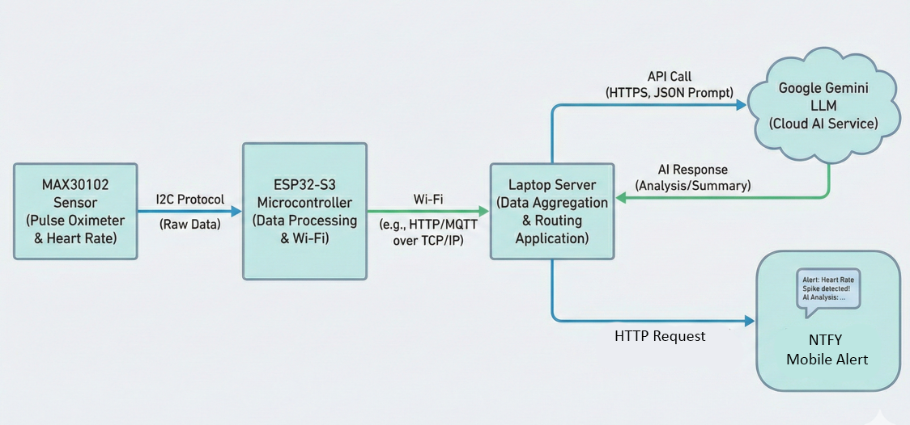

# Lab 2: Communication and Networking

## Background

In Lab 1, you mastered local hardware control. Lab 2 shifts the focus to **Communication and Networking in IoT Systems**. You will start by controlling an LED through your mobile over WiFi, and then build an Intelligent Health device.

---

## Task 1: WiFi Based LED Control (In-Lab)

Your goal is to turn the ESP32 into a web server that can be accessed by other devices on a Local Area Network (LAN). This will allow us to send an HTTP request to the ESP32 over WiFi and get it to toggle an LED ON and OFF.

### **1. Creating a Local Area Network (LAN)**

Your ESP32 and Laptop must be on the same network to communicate directly.

1. **Mobile Hotspot:** Create a hotspot with your phone.
2. **Connect:** Connect **BOTH** your Laptop and the ESP32 to this hotspot.

### **2. Connecting the ESP32-S3 to WiFi**

This snippet handles the initial setup of the ESP32 hardware and establishes the connection to your mobile hotspot.

```cpp
#include <WiFi.h>

const char* ssid = "YOUR_HOTSPOT_NAME";
const char* password = "YOUR_PASSWORD";
const int LED_PIN = 2; // Check your board's LED pin

void setup() {
  Serial.begin(115200);
  
  // Connect to WiFi
  WiFi.begin(ssid, password);
  
  // Wait for connection (Blocking Loop)
  while (WiFi.status() != WL_CONNECTED) { 
    delay(500); 
    Serial.print("."); 
  }
  
  Serial.println("\nConnected! IP Address: ");
  Serial.println(WiFi.localIP()); 
}

void loop() {
  // Nothing here yet
}

```

**Test:** Open the Serial Monitor to find the ESP32's IP (e.g., `192.168.x.x`).

### 3. Setting up a Web Page on the ESP32-S3

Once connected, you add the `WebServer` logic to handle browser requests and toggle the LED.

```cpp
#include <WebServer.h>

WebServer server(80); // Standard HTTP port

// Toggle Handler
void handleToggle() {
    // Implement this
}

void setup() {
  // ... (Previous WiFi setup code here) ...

  // Define Server Routes
  // 1. Root Page: Displays the button
  server.on("/", []() {
    server.send(200, "text/html", 
      "<h1>ESP32 Control</h1><a href='/toggle'><button>Toggle LED</button></a>");
  });
  
  // 2. Toggle Action: Handles the button click
  server.on("/toggle", handleToggle);
  
  server.begin(); // Start the server
}

void loop() {
  server.handleClient(); // Listen for incoming requests
}

```

Finally, enter the ESP-32's IP in your laptop or phone browser. Make sure the laptop or phone is connected to the same hotspot. Clicking the button should toggle the LED.
Here is the revised section, focusing specifically on targeting the ESP32 and clarifying the IP "Bridging" concept.

--- 

## Task 2: Going Global (Remote Access) (Take Home)

Currently, your LED control only works if your Client and Server are on the same WiFi. To control the LED from anywhere in the world (e.g., via 4G), you need a **Gateway** to the public internet. Since your ESP32 has a private local IP (unreachable from the outside), we will use your laptop as a gateway. The goal is to be able to toggle the LED from anywhere on earth.

### **The Laptop as a Tunnel**

Think of your laptop as a translator between two worlds:

1. **The Public Internet:** Your laptop runs `ngrok`, which generates a public URL (e.g., `https://random-name.ngrok-free.app`). Anyone on the internet can talk to this URL.
2. **The Private LAN:** Your laptop is also connected to your local hotspot, so it can see the ESP32's private IP (e.g., `192.168.43.50`).

When a request hits the public URL, `ngrok` catches it on your laptop and "tunnels" it directly to the ESP32's local IP. The ESP32 thinks the request came from your laptop, not the internet.

### **The Ngrok Tunnel Setup**

1. **Download:** Install ngrok from [ngrok.com](https://dashboard.ngrok.com/signup).
2. **Identify:** Find your ESP32's IP address in the Serial Monitor (e.g., `192.168.1.50`).
3. **Tunnel:** Open your terminal and run the command below. Replace the IP with your ESP32's actual IP:
`ngrok http <ESP32_IP>:80` *Note: We use port `80` because we used it previously.*

4. **URL:** Copy the forwarding URL (e.g., `https://1234-abcd.ngrok-free.app`).

**Test:** Use your partner's phone (The one not connected to the hotspot). Connect it to Wireless / LUMS-Events and try to open this URL. You should now be able to toggle the LED from anywhere! You only need to submit a video demo for this part.

---

## Task 3: Intelligent Health Monitoring (Take Home)

Now you will combine the sensor, the internet, and AI to create a heart health monitor. You will use a sensor to read the heartbeat and blood oxygen level, pass this to a flask server that will forward it to an LLM. The LLM will give you a medical recommendation that you will send as a notification alert on your phone.



### **1. MAX30102 Sensor**

The MAX30102 uses **Photoplethysmography (PPG)**. It shines Red (660nm) and Infrared (880nm) light into your finger to measure blood oxygen saturation and heart rate.

1. **Library:** Install **"SparkFun MAX3010x Pulse and Proximity Sensor Library"**.
2. **Wiring:** Connect the sensor via I2C (SDA/SCL) to your ESP32. You may use ``Wire.begin(sda, scl)`` to reconfigure the pins or refer to the ESP32-S3 pin out to see which pins are SDA and SCL by default. 
3. **Sampling:** Collect a buffer of atleast 100 samples (approx. 4 seconds) to calculate accurate averages.

```cpp
#include "MAX30105.h"
#include "spo2_algorithm.h"

MAX30105 particleSensor;

// Buffer setup
uint32_t irBuffer[100]; // Infrared LED sensor data
uint32_t redBuffer[100];  // Red LED sensor data
int32_t bufferLength = 100; // Data length

// Output variables
int32_t spo2; 
int8_t validSPO2; 
int32_t heartRate; 
int8_t validHeartRate;

void setup() {
  ...

  // Initialize Sensor
  if (!particleSensor.begin(Wire, I2C_SPEED_FAST)) {
    Serial.println("MAX30102 was not found. Please check wiring/power.");
    while (1);
  }

  // Sensor Configuration
  // brightness: 0=Off to 255=50mA
  // sampleAverage: 4
  // ledMode: 2 (Red + IR)
  // sampleRate: 100 (Samples per second)
  // pulseWidth: 411
  // adcRange: 4096
  particleSensor.setup(60, 4, 2, 100, 411, 4096); 
  
  Serial.println("Sensor Initialized. Place your finger on the sensor.");
}

void loop() {
  // 1. Collect 100 samples (approx 4 seconds)
  // This loop blocks until the buffer is full
  for (byte i = 0 ; i < bufferLength ; i++) {
    while (particleSensor.available() == false) 
      particleSensor.check(); // Check the sensor for new data

    redBuffer[i] = particleSensor.getRed();
    irBuffer[i] = particleSensor.getIR();
    particleSensor.nextSample(); // We're finished with this sample so move to next sample
  }

  // 2. Calculate SpO2 and Heartrate using library algorithm
  // This function processes the raw data in the buffer
  maxim_heart_rate_and_oxygen_saturation(irBuffer, bufferLength, redBuffer, &spo2, &validSPO2, &heartRate, &validHeartRate);

  // 3. Print Results
  if (validSPO2 == 1 && validHeartRate == 1) {
    Serial.print("Heart Rate: ");
    Serial.print(heartRate);
    Serial.print(" BPM");
    
    Serial.print("\t SpO2: ");
    Serial.print(spo2);
    Serial.println(" %");
  } else {
    Serial.println("Reading failed. Please adjust finger position and keep still.");
  }
}
```

### **2. Flask Server**

You will write a Flask server (`app.py`) that acts as the controller between your ESP32 and the Gemini Server. This server receives the SpO2 and BPM data from your ESP, consults Gemini, and publishes medical recommendations to your mobile phone.

#### **Initial Setup & File Navigation**

1. **Install Flask:** Open your terminal or command prompt and install the necessary libraries:
```bash
pip install flask google-generativeai requests

```


2. **Create Project Folder:** Create a new folder on your Desktop named `Health_Server`.
3. **Create the File:** Inside that folder, create a new text file and name it `app.py`. (Make sure the extension is `.py`, not `.txt`).
4. **Open in Editor:** Right-click the folder and open it in VS Code (or your preferred editor). You should see `app.py` in the file explorer on the left.


#### **Create the Flask HTTP Endpoint**

Define a route to receive the data. This function triggers whenever the ESP32 sends a POST request to `/recommend`.

```python
from flask import Flask, request, jsonify

app = Flask(__name__)

@app.route('/recommend', methods=['POST'])
def recommend_health():
    sensor_data = request.json  # Extract JSON (spo2 and bpm) from ESP32
    # ... (AI Logic will go here) ...
    return response.text, 200   # Sends the recommendation back to the ESP32

if __name__ == '__main__': 
    app.run()

```

#### **Setup Gemini API**

Go to [Google AI Studio](https://aistudio.google.com/) and create your API Key. You can then setup your Gemini model.

```python
import google.generativeai as genai
genai.configure(api_key="YOUR API KEY")

generation_config = {"temperature": 0.1, "response_mime_type": "application/json"}
model = genai.GenerativeModel("gemini-2.5-flash", generation_config=generation_config)

```

**Define the Medical Prompt**

Instruct the AI to evaluate the vitals and provide a short, actionable recommendation based on the data received.

```python
prompt = f"Analyze these vitals. Return JSON: {{'status': 'HEALTH_STATUS', 'recommendation': 'SHORT_ADVICE'}}. Data: {sensor_data}"

```

**Execute and Print Results**

Call the model and print the result to your computer's terminal to verify that it is working.

```python
response = model.generate_content(prompt)
print(f"Gemini Recommendation: {response.text}")

```

#### **Running the Server**

Once your pipeline is ready, you need to start the server to listen for connections.

1. **Run the Command:** inside your VS Code terminal (ensure you are in the `Health_Server` folder), type:
```bash
python app.py

```

*(If that doesn't work, try `python3 app.py`)*

2. **Check the Output:** You should see a message indicating the server is running. It will look like this:
```text
 * Running on http://127.0.0.1:5000

```


* **127.0.0.1** is your "localhost" (your computer's internal address).
* **5000** is the **Port Number**.


#### Exposing the Server via Ngrok

You will use this address and port number (5000) to set up a new Ngrok tunnel for your LAPTOP's server. This will allow your ESP32-S3 to access this server from anywhere on the internet.

To elaborate on the `ntfy` integration, here is the detailed breakdown including the Python code snippet you need to add to your Flask server.

### **3. Mobile Notification Setup (ntfy)**

We need to send the LLM advice from your Flask Server to your mobile phone as a real time alert. We will use **ntfy.sh** for this. It is a simple, HTTP-based notification service that allows you to send push notifications to your phone without writing a custom mobile app. 

**Step-by-Step Setup:**

1. **Download the App:** Install the **ntfy** app (available on iOS and Android) on your phone.
2. **Choose a Topic:** Pick a unique topic name (e.g., `health_monitor_abdullah`).
* *Note: Topics are public. If you pick a common name like "test", you will see notifications from random people. Choose something unique!*


3. **Subscribe:** Open the app, click the **+** button, and type in your chosen topic name. You are now listening for alerts.
4. **The Mechanism:** To send an alert, your Python server simply sends a "POST" request to `https://ntfy.sh/YOUR_TOPIC_NAME`. The body of that request becomes the notification text.

```python
import requests
NTFY_TOPIC = "medical_alerts_yourname" # CHANGE THIS to your unique topic!
message = "Hello World"
try:
    requests.post(f"https://ntfy.sh/{NTFY_TOPIC}", 
        data=message.encode(encoding='utf-8'))
except Exception as e:
    print(f"Error sending notification: {e}")

```

### 4. Making HTTP Requests from ESP32-S3

Once connected to WiFi, your ESP32 can act as a **Web Client** - just like a browser. Instead of displaying web pages, it can send data to servers and receive responses. This is how your ESP32 will communicate with your Flask server.

1. **Format the Payload:** Package your sensor data as a JSON string (e.g., `{"spo2": 98, "bpm": 72}`)
2. **Set Headers:** Tell the server you're sending JSON data (`Content-Type: application/json`)
3. **Execute POST Request:** Send the data and receive a response
4. **Clean Up:** Always free resources when done

```cpp
#include <HTTPClient.h>

// Create payload (JSON string)
String payload = "{\"spo2\":" + String(spo2) + ",\"bpm\":" + String(heartRate) + "}";

// Initialize HTTP client
HTTPClient http;
http.begin("YOUR_NGROK_URL_HERE/recommend");  // Replace with your ngrok URL
http.addHeader("Content-Type", "application/json");

// Send POST request
int httpResponseCode = http.POST(payload);

// Check response
if (httpResponseCode > 0) {
  String response = http.getString();  // Get the AI recommendation
  Serial.println("Server Response: " + response);
} else {
  Serial.print("Error on sending POST: ");
  Serial.println(httpResponseCode);
}

// Always free resources
http.end();
```

Add this code to your `loop()` function **after** calculating SpO2 and heart rate. Check Serial Monitor, to print and verify the response from the server.

## Integration & Submission

**Testing:** Place finger on sensor → ESP32 reads vitals → sends to Flask (via ngrok) → Gemini analyzes → ntfy notification appears on phone.

**Submit:** Zip all code (ESP32 `.ino`, Flask `app.py`) as `G_<GroupNo>.zip` + video demo showing: sensor reading → Serial Monitor → ntfy notification received. Make sure all tasks are in separate folders within the zip file.
